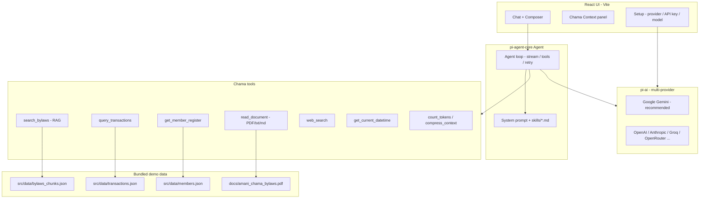

# Amani OS — Chama Dispute Arbitrator

**Live demo:** [https://amani-os-885974230787.europe-west1.run.app/](https://amani-os-885974230787.europe-west1.run.app/)

> **Hackathon track:** Challenge 02 — The Chama Dispute Arbitrator  
> Kenya has 300,000+ registered chamas. Billions of shillings move through them every year. The biggest threat is not bad investments — it is **unresolved fights between members**. Amani OS gives the treasurer an AI mediator that cites the chama’s own bylaws and payment records, in English, Kiswahili, or Sheng.

---

## The problem we are solving

When two members clash — late M-Pesa contributions, loan defaults, meeting absences, expulsion votes — the treasurer is stuck in the middle. They are not a lawyer. Arguments get emotional. WhatsApp threads go in circles. The committee meeting gets heated, and sometimes the dispute never gets a clear ruling tied to the bylaws.

**Amani OS** is an AI arbitration assistant a chama treasurer can open when things get heated. It:

- Reads the chama’s **bylaws** and cites the right articles (e.g. Article 3.3 penalties, Article 7 dispute process).
- Checks **M-Pesa / contribution records** (demo Paybill 247247 data in this build).
- Looks up the **member register** (status, missed months, roles).
- Answers in the **same language the treasurer uses** — English, Kiswahili, or Sheng.
- Produces structured **rulings** and tables the committee can review.

This repository is a working prototype for **Amani Investment Chama** (synthetic demo data). It is not legal advice; rulings should always be verified by humans before action.

---

## Agent architecture

Amani OS uses a **single orchestrator agent** (not a multi-agent swarm). One agent loop plans, calls tools, and streams the final answer to the UI.



| Layer | Role |
|--------|------|
| **UI** | Treasurer-facing chat, history, settings, markdown + chart artifacts |
| **Agent** | [@mariozechner/pi-agent-core](https://github.com/badlogic/pi-mono) — streaming, tool execution, session state |
| **LLM** | [@mariozechner/pi-ai](https://github.com/badlogic/pi-mono) — provider-agnostic; **Gemini** recommended for Kiswahili/Sheng |
| **RAG** | Bylaws chunked in `bylaws_chunks.json`; `search_bylaws` scores and returns relevant clauses |
| **Skills** | Markdown playbooks in [`skills/`](skills/) (identity, arbitration workflow, visualization, per-tool guides) |
| **Storage** | Chat sessions + API keys in **browser localStorage** only |

### Tools (how the agent “communicates” with data)
git 
| Tool | What it does |
|------|----------------|
| `search_bylaws` | Keyword/article search over ingested bylaws |
| `query_transactions` | Filter mock M-Pesa rows by member, month, penalties |
| `get_member_register` | Member list, roles, consecutive miss notes |
| `read_document` | Extract text from uploaded PDF / .txt / .md |
| `get_current_datetime` | Nairobi timezone for deadlines |
| `web_search` | Optional external context (e.g. Co-operative Societies Act) |
| `count_tokens` / `compress_context` | Long dispute threads — warn at 75%, compress at 90% |

There is **no separate “mediator” and “researcher” agent**. The same agent decides when to call tools, waits for results, and continues streaming the reply in **one merged message bubble** in the UI.

---

## How to run locally

**Requirements:** Node.js 20+, npm

```bash
git clone https://github.com/AmariahAK/Amani-OS.git
cd Amani-OS
npm install
npm run dev
```

Open [http://localhost:5173](http://localhost:5173).

1. **Setup** opens automatically on first visit.
2. Choose a **provider** (e.g. **Google** for Gemini).
3. Paste your **API key** (stored only in your browser).
4. Pick a **model** (e.g. `gemini-2.0-flash`).
5. Click **Save & start**.

Optional:

```bash
npm run ingest   # refresh bylaws_chunks.json from docs/amani_chama_bylaws.pdf (needs pdftotext)
npm run build    # production build
npm run preview  # serve dist locally
```

### Docker (same image as Cloud Run)

```bash
docker build -t amani-os .
docker run -p 8080:8080 amani-os
# → http://localhost:8080
```

---

## How to interact with the deployed version

**URL:** [https://amani-os-885974230787.europe-west1.run.app/](https://amani-os-885974230787.europe-west1.run.app/)

1. Open the link in Chrome or Firefox (desktop recommended).
2. Complete **Setup** with your own API key for the provider you choose. Keys are **not** stored on our server — only in your browser.
3. On the welcome screen, try a suggested prompt, for example:
   - *“Grace missed her contribution in Jan, what is the penalty?”*
   - *“Brian claims he doesn't owe any penalty. What do the bylaws say?”*
4. Or type in **Swahili / Sheng**, e.g. *“Nilichelewa kwa chama, nini itafanyika?”*
5. Attach a **PDF** (bylaws excerpt or evidence) with the paperclip — text is extracted in the browser.
6. Use **History** (sidebar) to switch past disputes. Use **+** for a new chat.

The footer shows which model you selected. Always **verify arbitration decisions with the full committee** before fines or expulsion.

---

## Screenshots & demo

| | |
|---|---|
| **Live app** | [https://amani-os-885974230787.europe-west1.run.app/](https://amani-os-885974230787.europe-west1.run.app/) |

---

## Team

| Name | Role |
|------|------|
| **Amariah Kamau** | Lead developer — agent integration, UI, deployment, demo data |
| **Tyra Kimani**| Analyst |
| **McGrath** | software developer|
| **Juma** | data engineer|
| _**John Alexander Kamau**_ | UX/UI Designer & Developer |

---

## Stack alignment (Challenge 02 brief)

| Suggested | How Amani OS implements it |
|-----------|----------------------------|
| Vertex AI / Gemini multilingual | **Google Gemini** via `pi-ai` (primary recommendation in Setup) |
| RAG | Bylaws chunks + `search_bylaws` tool |
| ADK-style agent | `pi-agent-core` agent loop + tools + skills |
| M-Pesa / records | Mock Paybill 247247 dataset; real API = future work |

---

## Data & security notes

- **Demo data only** — `src/data/transactions.json`, `members.json`, and bylaws are synthetic or bundled for **Amani Investment Chama** demo purposes.
- **API keys** — entered in Setup, saved in **localStorage** on the client. Never sent to our Cloud Run container.
- **Neutrality** — the agent is instructed to cite bylaws and records, not take sides; treasurers must confirm outcomes in committee.

---

## Project structure

```
src/
  agent/          # Agent factory, system prompt, token budget
  tools/          # Bylaws RAG, transactions, PDF read, etc.
  components/     # Chat UI, settings, history, artifacts
  data/           # Demo bylaws chunks, members, transactions
skills/           # Agent behavior markdown
docs/             # PDF bylaws source
Dockerfile        # Cloud Run (nginx + static build)
cloudbuild.yaml   # GCP build & deploy
```

---

## Scripts

| Command | Description |
|---------|-------------|
| `npm run dev` | Dev server (copies PDF.js worker automatically) |
| `npm run build` | Typecheck + Vite production build |
| `npm run ingest` | Regenerate `bylaws_chunks.json` from PDF |
| `docker build -t amani-os .` | Container image for Cloud Run |

---

## License

MIT
